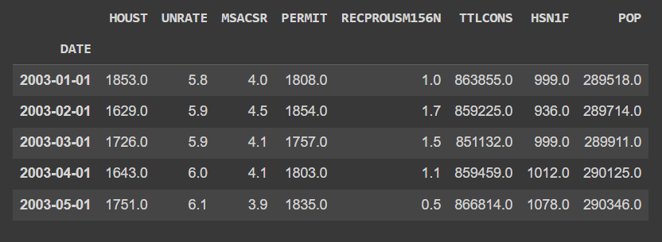
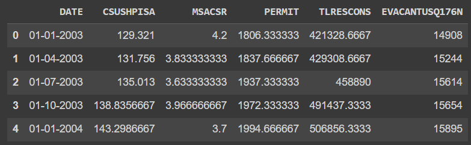
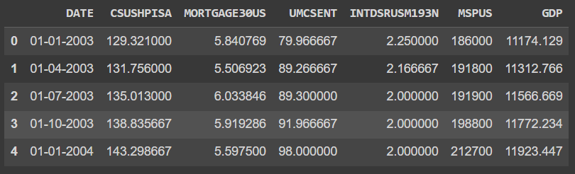
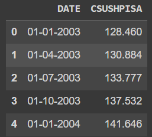
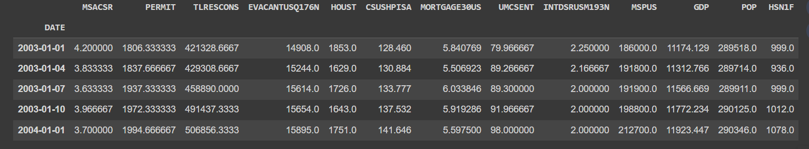

# Analyzing Key Supply Demand Factors Affecting U.S. Home Prices

# US Home Prices Analysis

## Overview

This repository contains a comprehensive analysis of the main supply and demand factors that influence US home prices on a national level. The analysis covers a period of 20 years, providing insights into the dynamics of the housing market.

## Data Acquisition and Dataset Creation

### Step 1: Data Scraping from FRED

To gather data on key supply-demand factors, we scraped publicly available data from the Federal Reserve Economic Data (FRED) website. The fields included in the data collection were:

- 'HOUST' (Housing Starts)
- 'UNRATE' (Unemployment Rate)
- 'MSACSR' (Monthly Supply of New Houses)
- 'PERMIT' (New Housing Units Authorized)
- 'RECPROUSM156N' (New Private Housing Units Started)
- 'TTLCONS' (Total Construction Spending)
- 'HSN1F' (New Privately Owned Housing Units Started)
- 'POP' (Population)

### Step 2: Create Supply and Demand Datasets

The collected data was divided into two datasets: one for supply factors and one for demand factors. The features included in each dataset are as follows:

# **Supply Dataset:**

- 'DATE'
- 'CSUSHPISA' (S&P Case-Schiller U.S. National Home Price Index)
- 'MSACSR' (Monthly Supply of New Houses)
- 'PERMIT' (New Housing Units Authorized)
- 'TLRESCONS' (Total Construction Spending: Residential)
- 'EVACANTUSQ176N' (Housing Inventory Estimate: Vacant Housing Units)

# **Demand Dataset:**

- 'DATE'
- 'CSUSHPISA' (S&P Case-Schiller U.S. National Home Price Index)
- 'MORTGAGE30US' (30-Year Fixed Rate Mortgage Average)
- 'UMCSENT' (University of Michigan: Consumer Sentiment)
- 'INTDSRUSM193N' (Interest Rates, Discount Rate)
- 'MSPUS' (Median Sales Price of Houses Sold)
- 'GDP' (Gross Domestic Product)

### Step 3: Fetch S&P Case-Schiller Home Price Index

The seasonally adjusted S&P Case-Schiller Home Price Index data was obtained from reliable sources such as the Federal Reserve or the official Case-Schiller website.

### Step 4: Create a Composite Dataset

To create a comprehensive dataset, the most influential and relevant features from the FRED data (Step 1) were selected and merged with the S&P Case-Schiller Home Price Index data (Step 3). This merged dataset includes supply and demand factors along with the home price index for the past 20 years.

### Step 5: Data Cleaning and Preprocessing

Data cleaning was performed to handle missing values i.e. implentations of KNNimputer to impute missing values, outliers, and ensure data consistency by converting each feature to numeric datatype.

### Step 6: Exploratory Data Analysis (EDA)

Exploratory data analysis was conducted to gain insights into data distribution, correlations, and trends. Visualizations were created to better understand the relationships between variables.All the Visualization plots are present inside the Notebook.Here are few

### Step 7: Model Building

Based on EDA insights, data science models, including regression analysis or machine learning algorithms, were employed to quantify relationships and make predictions.

## Interpretation and Insights

### Supply Factors:

Analyzing the coefficients of supply factors and their impact on the S&P/Case-Shiller U.S. National Home Price Index (CSUSHPISA) reveals intriguing patterns:

- **Monthly Supply of New Houses (MSACSR):** Despite a coefficient of 2.2013, the relationship is remarkably weak. In quantitative terms, this coefficient signifies a minor negative influence on housing prices due to increased supply.

- **Authorized Housing Units (PERMIT):** With a coefficient of -0.0177, a higher number of authorized housing units correlates with elevated property prices. This outcome is expected since increased authorizations impact the housing supply chain, ultimately driving prices upwards.

- **Total Construction Spending on Residential Projects (TLRESCONS):** Boasting a coefficient of 0.0001477, this factor significantly impacts home prices. Higher construction spending is robustly associated with elevated home prices, driven by the inclusion of various costs, such as labor and materials.

- **Estimated Vacant Housing Units (EVACANTUSQ176N):** Despite a coefficient of -0.0030, the relationship suggests that a greater number of vacant housing units can exert downward pressure on home prices. Increased housing supply can lead to price decreases.

### Demand Factors:

Quantitative analysis of demand factors and their coefficients reveals vital insights:

- **Average 30-Year Fixed-Rate Mortgage Interest (MORTGAGE30US):** Despite a coefficient of -0.8520, higher mortgage rates correlate with slightly lower home prices. This relationship stems from the impact of federal funds rate changes on mortgage rates and, consequently, home buying demand.

- **Consumer Sentiment (UMCSENT):** Displaying a coefficient of -0.2382, lower consumer sentiment is associated with slightly lower home prices. In practice, confident consumers tend to make significant investments like home purchases, which can drive up prices.

- **Interest Rates or Discount Rates (INTDSRUSM193N):** While the coefficient is technically positive at 2.6899, it's notably weak. The relationship implies that higher interest rates are slightly associated with elevated home prices, although scaling or trailing issues might obscure this connection.

- **Gross Domestic Product (GDP):** With a robust coefficient of 0.0065, GDP significantly impacts home prices. A flourishing economy, reflected in higher GDP figures, strongly supports elevated home prices.

- **Median Sales Price of Houses Sold (MSPUS):** Boasting a coefficient of -0.0000178, this factor indicates that higher median sales prices are strongly linked to elevated home prices. This underscores the importance of market dynamics and buyer behavior in influencing home price movements.

## Conclusion

In summary, the coefficients of supply and demand factors, guided by the Linear Regression model, yield valuable insights:

- Supply factors, including housing inventory and authorized housing units, exert a positive influence on home prices. Additionally, higher construction spending on residential projects substantially contributes to elevated home prices.

- Demand factors, notably mortgage interest rates and consumer sentiment, exhibit a negative impact on home prices. Higher mortgage rates and reduced consumer confidence correlate with slightly lower home prices.

- Economic factors, exemplified by GDP and interest rates, play pivotal roles in determining home prices. A robust economy, reflected in higher GDP and interest rates, favorably supports elevated home prices.

- The median sales price of houses sold serves as a potent indicator, showcasing a strong association with home prices. This underscores the significance of market dynamics and consumer behavior in shaping home price dynamics.

These findings equip stakeholders in the real estate market with data-driven insights for making informed decisions regarding investments, financing, and economic policies.

## Repository Structure

- `data/`: Contains the raw and processed datasets.
- `notebooks/`: Jupyter notebooks detailing data analysis and modeling.
- `images/`: Images used in documentation.

## How to Use

To reproduce the analysis, follow the steps outlined in the Jupyter notebooks in the `notebooks/` directory.

## License

This project is licensed under the MIT License - see the [LICENSE](LICENSE) file for details.
