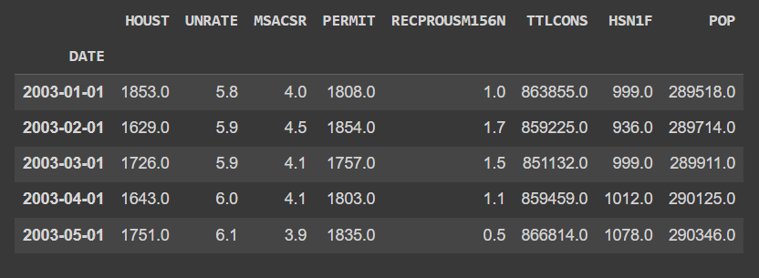
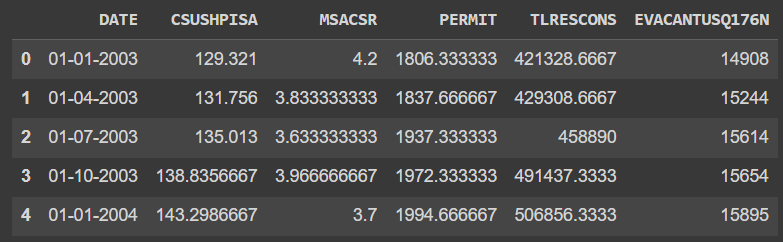
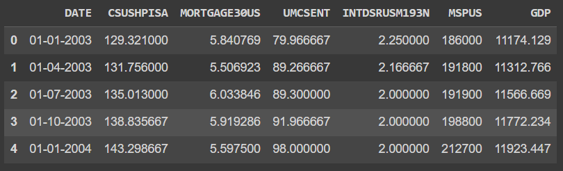
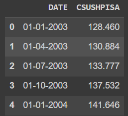

# Analyzing Key Supply Demand Factors Affecting U.S. Home Prices

# US Home Prices Analysis

## Overview

This repository contains a comprehensive analysis of the main supply and demand factors that influence US home prices on a national level. The analysis covers a period of 20 years, providing insights into the dynamics of the housing market.

## Data Acquisition and Dataset Creation

### Step 1: Data Scraping from FRED

To gather data on key supply-demand factors, we scraped publicly available data from the Federal Reserve Economic Data (FRED) website. The fields included in the data collection were:

- 'HOUST' (Housing Starts)
- 'UNRATE' (Unemployment Rate)
- 'MSACSR' (Monthly Supply of New Houses)
- 'PERMIT' (New Housing Units Authorized)
- 'RECPROUSM156N' (New Private Housing Units Started)
- 'TTLCONS' (Total Construction Spending)
- 'HSN1F' (New Privately Owned Housing Units Started)
- 'POP' (Population)

### Step 2: Create Supply and Demand Datasets

The collected data was divided into two datasets: one for supply factors and one for demand factors. The features included in each dataset are as follows:

# **Supply Dataset:**

- 'DATE'
- 'CSUSHPISA' (S&P Case-Schiller U.S. National Home Price Index)
- 'MSACSR' (Monthly Supply of New Houses)
- 'PERMIT' (New Housing Units Authorized)
- 'TLRESCONS' (Total Construction Spending: Residential)
- 'EVACANTUSQ176N' (Housing Inventory Estimate: Vacant Housing Units)

# **Demand Dataset:**

- 'DATE'
- 'CSUSHPISA' (S&P Case-Schiller U.S. National Home Price Index)
- 'MORTGAGE30US' (30-Year Fixed Rate Mortgage Average)
- 'UMCSENT' (University of Michigan: Consumer Sentiment)
- 'INTDSRUSM193N' (Interest Rates, Discount Rate)
- 'MSPUS' (Median Sales Price of Houses Sold)
- 'GDP' (Gross Domestic Product)

### Step 3: Fetch S&P Case-Schiller Home Price Index

The seasonally adjusted S&P Case-Schiller Home Price Index data was obtained from reliable sources such as the Federal Reserve or the official Case-Schiller website.

### Step 4: Create a Composite Dataset

To create a comprehensive dataset, the most influential and relevant features from the FRED data (Step 1) were selected and merged with the S&P Case-Schiller Home Price Index data (Step 3). This merged dataset includes supply and demand factors along with the home price index for the past 20 years.

### Step 5: Data Cleaning and Preprocessing

Data cleaning was performed to handle missing values i.e. implentations of KNNimputer to impute missing values, outliers, and ensure data consistency by converting each feature to numeric datatype.

### Step 6: Exploratory Data Analysis (EDA)

Exploratory data analysis was conducted to gain insights into data distribution, correlations, and trends. Visualizations were created to better understand the relationships between variables.

### Step 7: Model Building

Based on EDA insights, data science models, including regression analysis or machine learning algorithms, were employed to quantify relationships and make predictions.

### Step 8: Evaluation and Conclusion

Model performance was evaluated using metrics such as mean squared error (MSE) and R-squared. Conclusions were drawn, providing insights into the key supply and demand factors influencing US home prices nationally.

For more details on the analysis and findings, refer to the associated code and documentation.

## Repository Structure

- `data/`: Contains the raw and processed datasets.
- `notebooks/`: Jupyter notebooks detailing data analysis and modeling.
- `images/`: Images used in documentation.

## How to Use

To reproduce the analysis, follow the steps outlined in the Jupyter notebooks in the `notebooks/` directory.

## License

This project is licensed under the MIT License - see the [LICENSE](LICENSE) file for details.
